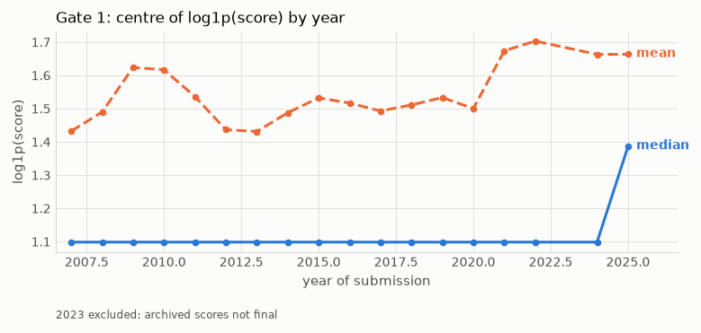
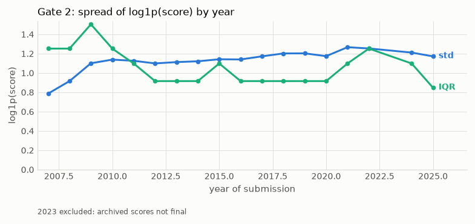
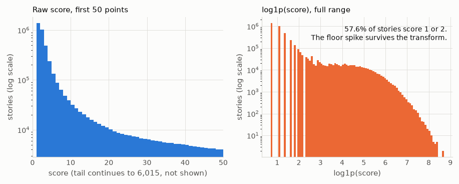
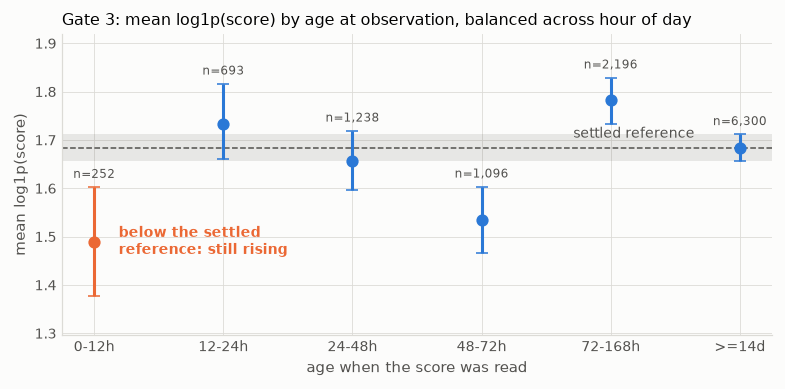

# Design notes

The reasoning behind the choices the [README](../README.md) states. Read this before
changing the target transform, the tokeniser, or the embedding hyperparameters.

## Contents

- [Why not raw score](#why-not-raw-score)
- [The target transform](#the-target-transform)
- [Why a z-score and not a percentile](#why-a-z-score-and-not-a-percentile)
- [The trailing window and the settling lag](#the-trailing-window-and-the-settling-lag)
- [The source dump](#the-source-dump)
- [Tokenisation: the `words` column against ours](#tokenisation-the-words-column-against-ours)
- [Embeddings](#embeddings)
- [Fusion architectures](#fusion-architectures)
- [Evaluation](#evaluation)

## Why not raw score

Hacker News has grown. The same quality of post earns more points now than it did years
ago, so a model trained on old data systematically under-predicts new posts. It judges
the post correctly while the ruler moves underneath it.

Train on 2011 and the model learns "great post equals 50 points". Test it on 2025 and it
says 50 when the answer is 300. Nothing is wrong with its judgement. The units changed.

The obvious fix does not work. Adding `year` as a feature fails under a temporal split.
Training stops years before the test period, so a tree has no branch for a year it never
saw. Every test-period post falls into the last training bucket and gets that era's
numbers. Teaching someone 2011 grocery prices and then telling them "it is 2025 now"
does not let them price a 2025 shop.

So change the question instead of the features. Stop predicting how many points a post
gets. Predict how good it is compared to posts from around the same time.

| | Raw points | Compared to peers |
|---|---|---|
| Great post, 2011 | 50 | Way above average |
| Great post, 2025 | 300 | Way above average |

The left column moves with the years. The right column does not. That is why a model
trained on old data still works on new data.

Points stay the ground truth throughout. The baseline is computed from points, the
target is computed from points, and the reported prediction converts back to points.
What changes is that the model predicts a position relative to peers instead of a bare
number.

Replace `year` with features that mean the same thing in any era: hour of day, day of
week, and rolling statistics such as how the author has done recently.

### What Phase 1 measured

**The premise above is correct. The fix proposed for it is not.**

Era drift is real. Scoring inflation is concentrated in the tail, and none of the four
statistics a trailing transform can use will show it: not the mean, not the median, not
the standard deviation, not the interquartile range.



The median is the flat line. It takes one value for eighteen consecutive years, and 2023
is missing because its archived scores are not final. The mean wanders between 1.43 and
1.70 with no trend.



The two spread measures cross and diverge. Neither is tracking a trend.

Raw score by percentile, 2007 against 2025:

| Percentile | 2007 | 2025 | Ratio |
|---|---|---|---|
| 50th | 2 | 3 | 1.5x |
| 75th | 6 | 6 | 1.0x |
| 90th | 13 | 26 | 2.0x |
| 95th | 19 | 89 | 4.7x |
| 99th | 38 | 355 | 9.3x |
| 99.9th | 89 | 1,001 | 11.2x |

Below the 75th percentile nothing moves. Above the 95th everything does. The plan's
illustration was "a great post in 2011 might have got 50, in 2025 it might get 300". For
great posts that is close to right: the 99th percentile went from 207 in 2011 to 355 in
2025 and the 99.9th from 526 to 1,001. For a typical post it is wrong.

Meanwhile the statistics the transform reads do not track it. Median `log1p(score)` is
`log1p(2)` in every year from 2007 to 2024. The standard deviation moves 1.1386 to 1.1721
across 2010-2025, which is 2.9%. The IQR moves in the opposite direction, 1.2528 to
0.8473, with a year correlation of -0.098.

**The flat median is largely an artefact and must not be read as evidence of stability.**
57.6% of stories score 1 or 2 points. With more than half the distribution on the floor,
the median is pinned there by construction and would read `log1p(2)` every year whatever
happened above it. The same spike pins the IQR, whose 25th percentile is `log1p(1)` in
every year. Eighteen flat years of median is weak evidence about scoring inflation, not
strong evidence against it.

### Why the transform still comes out

Not because the data is stationary. Because the instrument does not touch the moving
part.

A trailing z-score is an affine correction fitted to a location and a scale. Here the
location did not move and the scale moved 2.9%, while the 99th percentile of raw score
moved 9.3x. Subtracting a centre that is flat and dividing by a spread that is flat
leaves the tail exactly where it was. **Switching the transform on would not have
corrected the drift.** It was the wrong instrument for the drift that exists, not the
right instrument for a drift that does not.

So it is switched off, which costs nothing and removes machinery that would otherwise
imply the problem had been dealt with. The target is plain `log1p(score)`. The machinery
stays in the tree behind one config change, in case a later phase finds a statistic that
does track the tail.

### The residual risk, carried forward

**Tail drift is unhandled.** This is an open problem, not a closed finding.

A model trained on early years and tested on recent ones will mis-rank the tail, and the
tail is the region a submission-time predictor is for. Nobody needs help telling a
1-point post from a 2-point post.

Phase 2's walk-forward folds are where this has to be dealt with. Spearman on raw score
and Precision@100 are the two metrics that will expose it, because both are sensitive to
ranking in the upper region and neither is flattered by the target transform. If the
fold-over-fold sequence degrades as it moves forward in time, this is why. Candidate
responses, none of them yet tested: a trailing high quantile as the scale, rank-space
targets fitted within a trailing window, or an explicit tail-aware loss.

## The target transform

```
target = (log1p(score) - baseline_centre) / baseline_spread
score  = expm1(target * baseline_spread + baseline_centre)
```

Both statistics come from a trailing window, so both are available at inference and the
inverse works in production, not only in a backtest.

A worked example. **These baselines are illustrative, not measured.** They demonstrate
the mechanism.

| Post | Raw score | `log1p` | Baseline centre | Baseline spread | Target |
|---|---|---|---|---|---|
| Strong post, earlier era | 50 | 3.93 | 1.8 | 1.2 | **1.78** |
| Its later-era equivalent | 183 | 5.21 | 2.9 | 1.3 | **1.78** |
| A stronger later-era post | 300 | 5.71 | 2.9 | 1.3 | **2.16** |

Row one: `log1p(50) = 3.93`, and `(3.93 - 1.8) / 1.2 = 1.78`.
Row two: `log1p(183) = 5.21`, and `(5.21 - 2.9) / 1.3 = 1.78`.

The first two rows differ by 3.7x in raw score and are identical in target. That is the
mechanism working. The third row is a better post than the second and the target says
so: `(5.71 - 2.9) / 1.3 = 2.16`.

Reporting inverts it. Nobody wants "1.78 above average", they want "about 180 points".
Train in the ruler-proof space, report in the human one.

## Why a z-score and not a percentile

The z-score is chosen for invariance, not for probability. It is an affine transform, so
it preserves rank exactly, removes location drift by subtracting, and removes scale
drift by dividing. No distributional assumption is required for that job.

A z-score only becomes a probability statement under approximate normality, which does
not hold here. Measured over the 4,168,189 settled stories: 32.9% score exactly 1 and
24.7% score exactly 2, so **57.6% of all stories sit at 1 or 2 points**. `log1p` is
monotone, so it cannot spread a point mass: the spike moves to 0.693 and 1.099 and stays
exactly as tall. Treat any percentile conversion as indicative.



| Score | Stories | Share |
|---|---|---|
| 1 | 1,372,666 | 32.9% |
| 2 | 1,027,583 | 24.7% |
| 3 | 488,649 | 11.7% |
| **1 or 2** | **2,400,249** | **57.6%** |

That share also settles the secondary-readout question. Percentile rank is worth
reporting, but it cannot be the target: with 57.6% of the mass on two values, more than
half of all stories share one of two percentile ranks, and any ranking inside that block
is arbitrary.

Percentile rank within the trailing window is the distribution-free alternative, and is
uniform on `[0,1]` by construction. It is rejected as the training target because it
flattens the tail: a 500-point post and a 3000-point post both sit near the 99.9th
percentile, and the tail is the interesting region. Percentile is reported as a
secondary readout instead.

Separately, squared error is maximum likelihood under Gaussian *residuals*, not a
Gaussian target. If the Phase 2 residual plot comes out heavy tailed, the loss switches
to Huber. Those are different claims and only the second one is a reason to change loss.

## The trailing window and the settling lag

The baseline for a row uses rows in `[t - lag - window, t - lag)`. Two rules, both load
bearing.

**Strictly earlier.** The upper bound is exclusive, so a row can never contribute to its
own baseline, and neither can anything submitted at the same instant or later. Using the
post's own calendar month would include posts submitted after it, which nobody could
know at submission time. That makes test scores fake. A trailing window is always
finished, always knowable, and behaves the same in testing and in production.

**Settling lag.** A post from three hours ago is still gaining votes. Letting it into
the baseline drags the centre down with scores that are not final.

The reference implementation of the window bound is
[`compute_trailing_baseline`](../src/hn_upvotes/target/normalise.py). Every other
rolling statistic in the project copies its bound.

### What the lag came out as

24 hours, down from the scaffold's assumed 48. 13,852 current scores were read from the
live HN API in one pass at 2026-08-06 06:22 UTC. One reading instant across posts of
many ages gives the curve directly.



| Age at observation | Mean `log1p(score)` | 95% interval |
|---|---|---|
| 0-12 h | 1.490 | 1.377 to 1.603 |
| 12-24 h | 1.733 | 1.662 to 1.816 |
| 24-48 h | 1.656 | 1.597 to 1.719 |
| 48-72 h | 1.534 | 1.467 to 1.603 |
| 72-168 h | 1.782 | 1.732 to 1.829 |
| 14 days and older | 1.683 | 1.656 to 1.712 |

Only the 0-12 hour band sits below the settled reference with a clear gap. The 12-24 hour
band already overlaps it. Later bands wander above and below by more than their intervals,
which is day-to-day cohort variation rather than settling, so the answer is the top of the
interval where settling completes.

Each band is averaged over its UTC hour-of-day cells with equal weight, because with one
reading instant a post's age and its submission hour are locked together. The raw
unbalanced curve is [`gate3-settling-curve.png`](img/gate3-settling-curve.png); at this
sample size the mean is noise and the median is pinned to the floor spike, which is why
the band chart carries the conclusion.

### The method, and why the archive's own timestamps could not supply it

The dataset publishes `stats.csv`, one row per committed month, with a `committed_at`
timestamp. That is the instant the month's file was fetched from the HN API, so **every
score in that file was read at that one moment**. A story's age when its score was
observed is `committed_at - time`. A story submitted an hour before the fetch is one
hour old. One submitted on the first of the month is thirty days old. A single monthly
file therefore holds posts at every age from minutes to a month, and median score
against age falls out of it directly.

Several recent months are combined so day-of-week and hour-of-day effects average out.

**The caveat, stated plainly: these are different posts at different ages, not the same
post tracked over time.** If the posts submitted late in a month were systematically
better or worse than the ones submitted early, that cohort difference would show up in
the curve and be read as settling. Inside a single month the effect is small, but it is
real, and it is the reason this is a measurement of a lag rather than of a vote-arrival
curve.

## The source dump

[`open-index/hacker-news`](https://huggingface.co/datasets/open-index/hacker-news).
Monthly Parquet files, zstd, licence `odc-by`, read with DuckDB over `hf://` directly.

Layout is `data/YYYY/YYYY-MM.parquet` for committed months plus
`today/YYYY/MM/DD/HH/MM.parquet` for five-minute live blocks. At midnight UTC the
current month is refetched from source as one authoritative file and that day's `today/`
blocks are deleted. **The archive is live.** Every row count in this repo is a snapshot
and carries its date.

### Four things not in its documentation

Each of these cost time to find and each is now encoded in
[`data/ingest.py`](../src/hn_upvotes/data/ingest.py).

1. **`by` is a reserved word in DuckDB.** It has to be double quoted in every query, or
   the parser fails on the column list.
2. **Missing values are sentinels, not SQL `NULL`.** An absent title is `''` and an
   absent score is `0`. `count(title)` returns the full row count on a table of
   comments, so any filter written against `IS NOT NULL` silently keeps everything.
3. **`time` is `TIMESTAMP_MICROS` in UTC**, not the unix seconds the HN API returns.
   DuckDB reads it as `TIMESTAMPTZ` and renders it in the session timezone unless it is
   cast with `AT TIME ZONE 'UTC'`. Get this wrong and every month boundary shifts.
4. **The column projection is what makes this affordable.** The sixteen columns occupy
   11.93 GB compressed. `text` is 6.18 GB of that and `words` is 4.67 GB. The eight
   columns this project needs are 776 MB, and DuckDB pushes the projection into the
   Parquet reader, so that is what actually crosses the network.

### The `type` encoding

`type` is `int8` and the mapping is not documented upstream. It was derived, not
guessed. Each code was characterised by which columns it carries, then one id per code
was fetched from `https://hacker-news.firebaseio.com/v0/item/<id>.json` and its `type`
string read off. All five agreed.

| Code | Name | Checked id | Shape in the dump |
|---|---|---|---|
| 1 | story | 44147768 | title, score, url, no parent |
| 2 | comment | 44147746 | parent, no title, no score |
| 3 | poll | 44192767 | title, score, descendants, no url |
| 4 | pollopt | 44192768 | score, no title, ids follow their poll's |
| 5 | job | 44169039 | title, url, score of 1, no descendants |

The scaffold's intended shortcut, "stories are the only type with both a title and a
score", is **false**. Polls and jobs carry both. On `2025-06` the counts among
title-and-score rows are 31,529 for stories, 46 for jobs and 3 for polls, so
`find_story_type_code` picks the modal code rather than the only one. Three orders of
magnitude is a safe margin and it holds in every month checked.

## Tokenisation: the `words` column against ours

The dump ships a pre-tokenised `words` column. Phase 1 compared it against
[`tokenise`](../src/hn_upvotes/data/preprocess.py) rather than trusting either blindly.
**The project uses its own tokeniser.** Two reasons, both measured on `2026-06`.

**`words` tokenises `text`, not `title`.** It is populated for 2,474 of the 30,102
titled stories that month, which is 8.2%. Those are the 2,446 Ask HN posts that have a
body, plus 28 edge cases where the body was later emptied. A link story with a title and
a URL has no `words` entry at all, and link stories are 92% of the corpus. The title is
the one field this project needs tokenised, and `words` does not cover it.

**`words` is a set, not a sequence.** It is sorted alphabetically and deduplicated. CBOW
and Skip-gram are both defined over a context window, which needs word order. Even where
`words` exists, it cannot train an embedding.

### Agreement on the input they do share

Over 5,000 rows of `2026-06` that carry both `text` and `words`, comparing `words`
against `tokenise(normalise_title(text))` as sets:

| Measure | Value |
|---|---|
| Micro Jaccard (pooled over all tokens) | 0.899 |
| Exact set match | 32.9% of rows |

So the two tokenisers broadly agree and the disagreements are systematic, not random.
Three classes, over the token instances this tokeniser produces and `words` does not:

| Class | Share | What happens |
|---|---|---|
| Contractions | 42.1% | `words` splits `don't` into `don` and `t`. This keeps it whole |
| HTML markup | 34.0% | `words` strips tags first. This does not, so it emits `href`, `rel` and `nofollow` from a comment body |
| Hyphens | 18.2% | `words` splits `ad-free` into `ad` and `free`. This keeps it whole |
| Other | 5.7% | |

The hyphen class is the one that matters on Hacker News. `gpt-4`, `self-hosted` and
`k8s` are single content words, and splitting them throws away the thing that makes the
title informative.

The HTML class is a genuine weakness of this tokeniser, and it is a weakness on `text`
only. Titles carry HTML entities, never tags, and `normalise_title` unescapes them. It
unescapes twice, because the dump contains double-escaped entities such as `&amp;#x27;`
that one pass leaves as a literal `&#x27;`. If a later phase tokenises `text`, it needs
a tag-stripping step first.

## Scores that are not final

**Two windows of months record the score at submission instead of after the post
finished scoring.** Their `score` cannot be used as a label. This was not documented
upstream and it is not visible without checking against the live API.

Found by refetching 70 stories per month from `/v0/item/<id>.json` and comparing:

| Month | Archived mean | Live mean | Rows identical |
|---|---|---|---|
| 2022-11 | 32.30 | 34.39 | 82.9% |
| 2022-12 | 1.69 | 11.40 | 37.1% |
| 2023-05 | 2.27 | 11.43 | 38.6% |
| 2023-11 | 1.46 | 10.46 | 42.0% |
| 2023-12 | 11.71 | 25.24 | 64.3% |
| 2024-01 | 22.07 | 22.07 | 100% |
| 2025-11 | 11.17 | 11.17 | 100% |
| 2026-07 | 1.76 | 21.33 | 34.3% |

A clean month matches on 83% to 100% of rows and its mean is within a few percent. An
affected month matches on 34% to 54% and its mean is 5 to 8 times too low.

The split is clean rather than a judgement call. Of the 233 months holding at least
1,000 stories, 20 have a mean `log1p(score)` below 1.10 and 213 are above 1.26. One
month, `2023-12`, sits between them at 1.199 with 64% agreement, and is excluded with
the rest.

The affected months are **2022-12 through 2023-12** and **2026-01 through 2026-08**:
569,815 stories, 12.0% of the ingest. Two separate windows, so this is a recurring
upstream regression rather than one bad run.

They are kept in `data/stories.parquet` and excluded at read time by
`ingest.drop_unsettled_months`. Their titles, authors and timestamps are still true, and
a later phase may want them for something that is not a label.

### Why gate 3 could not use `committed_at`

The brief's method for the settling gate reads a story's age at observation as
`committed_at - time`. That needs the file's commit to be close in time to the month it
covers, and it needs the scores in it to have been read at that commit. Neither holds.

Of the 239 committed months, 231 were backfilled in a single pass on 2026-03-14, so
their ages at observation run from 13 days to 19 years. Only 6 were committed at their
own month boundary: 2026-03 through 2026-08. **Those are exactly the months whose scores
were captured at submission.** The one property that makes a month usable for the gate
travels with the one property that makes it useless.

So gate 3 keeps the brief's method, a single observation instant across posts of many
ages, and gets the instant from a live read of the HN API instead.

## Embeddings

### Terminology

CBOW and Skip-gram are training **objectives**, not embeddings. You train a model on a
fill-in-the-blank task, throw the task away, and keep the input weight matrix, one row
per word. That matrix is the embedding. The phrase "CBOW embeddings" does not appear in
this project's writing.

Both objectives learn two matrices, centre and context. Convention keeps the first.
Averaging the two is a cheap variant and is tested.

- `cbow.py` predicts the centre word from the averaged context vectors
- `skipgram.py` predicts context words from the centre word

Skip-gram generates one training pair per context position instead of one per window, so
it sees more updates per token, trains slower, and generally does better on rare words.

### Negative sampling, and where each number comes from

A full softmax over a 100k vocabulary is not viable, so both objectives use negative
sampling. Hyperparameters follow Mikolov et al. 2013.

| Setting | Value | Source |
|---|---|---|
| Negative samples `k`, text8 and HN titles | 15 | Paper recommends 5 to 20 for small corpora |
| Negative samples `k`, Wikipedia subset | 5 | Paper recommends 2 to 5 for large corpora |
| Noise distribution | Unigram counts raised to 0.75 | The paper's tuned value, best of the distributions tried |
| Frequent-word subsampling | `t = 1e-5` | The paper's rule, `P(keep) = min(1, sqrt(t/f))` |
| Context window | Dynamic, sampled from 1 to 5 | Weights nearer context words more heavily at no extra cost |

The 0.75 power flattens the unigram distribution so rare words turn up as negatives more
often than their raw frequency would allow. `k` is tunable and these are starting points.

### Development and validation

Development runs on `text8`, 100 MB, which trains in minutes and makes the
implementation debuggable. Correctness is checked against gensim on the same corpus
before anything scales up. Matching gensim within noise on text8 is the gate for moving
to the Wikipedia subset.

A from-scratch PyTorch SGNS runs one to two orders of magnitude slower than gensim's
Cython. The subset size is chosen from a measured tokens-per-second figure, not a guess.

Intrinsic evaluation uses the Google analogy set, WordSim-353, and nearest-neighbour
spot checks on HN vocabulary (`rust`, `yc`, `llm`). Coverage is reported alongside
accuracy, because a small vocabulary can post a flattering score on the few questions it
can answer. Intrinsic scores are a sanity check. The result is the downstream task.

### Three variants

| Variant | Initialisation | Trained on |
|---|---|---|
| wiki-only | Random | Wikipedia subset |
| hn-only | Random | HN titles |
| fine-tuned | Wikipedia vectors | HN titles at a lower learning rate |

Words appearing in HN but not in Wikipedia get random initialisation before fine-tuning.

### Title vector

Mean pooling by default. SIF (smooth inverse frequency weighting plus removal of the
first principal component, Arora et al. 2017) is the upgrade. Both sit behind one
interface in [`features/pooling.py`](../src/hn_upvotes/features/pooling.py), so the
fusion models do not know which is active.

SIF is fitted on training rows only. Fitting the word frequencies or the principal
component on the full frame would leak test-period vocabulary statistics backwards.

## Fusion architectures

Four inputs: the pooled title vector, the author, the domain, and the temporal features.
Author and domain are high cardinality, so they get learned embedding tables, with values
below a minimum post count bucketed to a shared out-of-vocabulary row.

| Architecture | Structure | Learns interactions | Notes |
|---|---|---|---|
| Early | Concatenate all four, one MLP to a scalar | Yes | A weak modality can drag the shared representation |
| Late | One tower per modality to its own scalar, learned combination | No | Interpretable per modality, degrades gracefully when one is missing |
| Hybrid | Encode each modality, concatenate the encodings, joint head | Yes | What production ranking systems usually do |

Late fusion is the one that handles a text post cleanly: no URL means the domain tower
drops out and the weights renormalise.

Ablations drop each modality in turn, so the results can state what each one is worth
rather than asserting it.

## Evaluation

Four metrics, in `training/metrics.py`:

- **RMSE and MAE on `log1p(score)`**, the space the model trains in. With the transform
  off that is also the space a score can be read back out of, so no mapping is needed.
- **Spearman correlation on raw score.** Ranking quality is what a submission-time
  predictor is for, and rank is immune to the tail inflating across the split, which
  absolute error is not. `log1p` is strictly increasing, so Spearman on raw score and on
  `log1p(score)` are the same number and it is computed in the latter.
- **Precision@100.** Of the top 100 posts the model predicts, how many really landed
  high. Absolute error can look respectable while the ranking at the top is worthless.

Validation is a single time-based cut: train 2006-10 to 2022-11, test 2024-01 to 2025-12,
with the two unsettled windows dropped. Walk-forward was the original plan and is
deferred, on the grounds that it is worth its cost once one number is shown to be hiding
something. What it would expose is tail drift, and Spearman and Precision@100 are already
reported on the single cut. `splits.walk_forward_folds` is the seam.

The baseline rungs are deterministic given the split, so there is no seed noise to quote
for them. The five-seed mean and standard deviation applies to the fusion models from
Phase 5, where a single run is not evidence.

### The reporting format

This is the full table, all four metrics. The README carries the first three; Precision@100
is here only, because it cannot separate the rungs and the reason takes a paragraph. The
fusion rows are kept empty so the format is fixed before any number exists and cannot be
chosen after the fact to flatter a result.

There is no separate "RMSE (target)" column any more. With the transform off the target
*is* `log1p(score)`, so the two columns would hold the same number.

| Model | RMSE (`log1p` score) | MAE (`log1p` score) | Spearman | P@100 |
|---|---|---|---|---|
| 1. Trailing mean | 1.191 | 0.854 | 0.050 | 0 |
| 2. Author history | 1.210 | 0.844 | 0.176 | 1 |
| 3. Domain history | 1.220 | 0.852 | 0.154 | 0 |
| 4. Body text + Ridge | 1.197 | 0.808 | 0.040 | 2 |
| 5. All signals + Ridge | **1.149** | **0.802** | **0.297** | 0 |
| 6. All signals + XGBoost | 1.152 | 0.814 | 0.265 | 1 |
| Early fusion | | | | |
| Late fusion | | | | |
| Hybrid fusion | | | | |

Measured 2026-08-06 on 599,937 test rows. P@100 is a count out of 100, not a fraction.
`make baselines` reproduces it into `artifacts/baselines.json`.

#### What the ranking columns say that error does not

**Rank separates the rungs and error does not.** Rung 1 to rung 5 moves RMSE by 3.6%,
from 1.191 to 1.149, and Spearman from 0.050 to 0.297, about six times. 49.5% of test
posts score 1 or 2, so a constant is already close to half the data and there is little
absolute error left to win. Order is a different question and the features do move it.
Anyone reading the error columns alone will conclude the features are worthless. They are
not; the error floor is just low. This is the Phase 2 headline and the README leads with
it.

**No rung can find the top 100, and P@100 cannot tell them apart.** This is why that
column is not on the front page: it is worth measuring and it is not worth ranking on. The
100th
highest-scoring test post scored 1,707 points. Every rung hits between 0 and 2. Picking
100 rows at random out of 599,937 has an expected hit count of

    100 * 100 / 599,937 = 0.017

so 0, 1 and 2 hits are all indistinguishable from chance. Rung 5 has the best rank
correlation of any rung and hits zero. Use P@100 to show that nothing reaches the tail,
not to rank models against each other. Ranking broadly and ranking the extreme tail are
different skills, and it is the second one a submission-time predictor would be for.

Embedding variants, downstream on the best fusion architecture:

| Variant | Objective | RMSE (target) | Spearman | Analogy acc. | WordSim-353 ρ |
|---|---|---|---|---|---|
| wiki-only | CBOW | | | | |
| wiki-only | Skip-gram | | | | |
| hn-only | CBOW | | | | |
| hn-only | Skip-gram | | | | |
| fine-tuned | CBOW | | | | |
| fine-tuned | Skip-gram | | | | |

Ablations, dropping one modality at a time:

| Dropped modality | RMSE (target) | Change vs full |
|---|---|---|
| None (full model) | | |
| Title | | |
| Author | | |
| Domain | | |
| Temporal | | |

Implementation check against gensim on the same corpus:

| Corpus | Metric | This implementation | gensim |
|---|---|---|---|
| text8 | Analogy accuracy | | |
| text8 | WordSim-353 ρ | | |

### Baseline ladder

Built before any neural network, so there is a real bar to clear. Every rung predicts
`log1p(score)` directly, because Phase 1 switched the trailing z-score off.

| Rung | Sees | Model |
|---|---|---|
| 1 | nothing | trailing mean of `log1p(score)` |
| 2 | the author | that author's trailing mean |
| 3 | the hostname | that hostname's trailing mean |
| 4 | the body text | TF-IDF of the body, its length, has-body, into Ridge |
| 5 | everything | Ridge |
| 6 | everything | XGBoost |

"Everything" is the title, the body text, the two trailing means, whether there is a
link, and the hour and weekday. Rungs 1 to 4 are single-signal so each one isolates what
one input is worth. Rungs 5 and 6 take the identical matrix, so the gap between them is
linear against non-linear and nothing else.

Rung 6 sees the same modalities as the fusion models, without learned representations, so
it is the honest comparison. If no fusion model beats it, the README says so. An honest
negative result reads better than a suspiciously good number.

Body text was added to the feature allowlist in Phase 2. It is legal because the poster
writes it before pressing submit, so it is not post-hoc the way the score, the comment
count and the reply ids are. The measurement behind the decision, on 2025-04 to 2025-06
with the top 5% bar at 84 points: a link submission carrying over 1,000 characters of
body reaches the top 5% 8.1% of the time, against 5.1% for a bare link. The effect is
largely a length effect, so length is a feature in its own right rather than something a
bag of words has to rediscover.

## References

- Mikolov, Sutskever, Chen, Corrado, Dean (2013). *Distributed Representations of Words
  and Phrases and their Compositionality.* NeurIPS.
  [arXiv:1310.4546](https://arxiv.org/abs/1310.4546). Source of the negative sampling
  count, the 0.75 noise power, and the `t = 1e-5` subsampling rule.
- Mikolov, Chen, Corrado, Dean (2013). *Efficient Estimation of Word Representations in
  Vector Space.* [arXiv:1301.3781](https://arxiv.org/abs/1301.3781). The CBOW and
  Skip-gram objectives, and the analogy evaluation set.
- Arora, Liang, Ma (2017). *A Simple but Tough-to-Beat Baseline for Sentence Embeddings.*
  ICLR. [OpenReview](https://openreview.net/forum?id=SyK00v5xx). The SIF pooling used in
  `features/pooling.py`.
- Finkelstein et al. (2002). *Placing Search in Context: The Concept Revisited.* ACM TOIS.
  The WordSim-353 similarity ratings.
